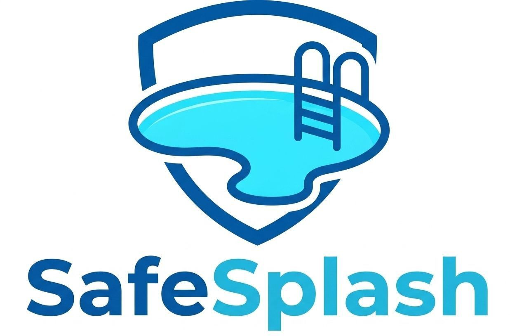

# SafeSplash: Sistema de Detección de Riesgo en Caso de Ahogamiento Para Piscina Semiolímpica

## Resumen ejecutivo

El ahogamiento es una de las principales causas de muerte accidental en el mundo, afectando desproporcionadamente a niños y jóvenes. En la Universidad del Norte, el aumento sostenido de usuarios en su piscina semiolímpica ha evidenciado las limitaciones del modelo de supervisión exclusivamente humano, el cual depende de la capacidad visual y estado de alerta del salvavidas, factores que pueden fallar ante fatiga, distracción o alta ocupación. Por lo tanto, se identifica la necesidad de un sistema de apoyo que detecte de forma temprana situaciones de riesgo de ahogamiento, reduciendo los tiempos de reacción y complementando la labor del personal de seguridad.

Para abordar esta problemática, se diseñó e implementó un prototipo funcional basado en visión por computadora y el modelo de detección de objetos YOLOv12. El sistema sigue una arquitectura de la forma cliente servidor en la que un dispositivo móvil Android captura el vídeo de los carriles y se procesa de manera local donde el modelo preentrenado y ajustado mediante fine tuning clasifica en tiempo real tres estados: natación normal, riesgo de ahogamiento y persona fuera del agua. Para el entrenamiento se combinó un dataset público con imágenes propias de la piscina universitaria, aplicando un preprocesamiento por tiling de dos por dos sobre el 66.5% de las imágenes del dataset proio aproximadamente. La validación se realizó exclusivamente con datos institucionales. Los resultados obtenidos muestran que el modelo alcanza un mAP con umbral de intersección sobre unión del cincuenta por ciento (mAP@50) de 0.86 en las tres clases, y la latencia total del sistema desde la captura hasta la alerta es inferior a diez segundos, cumpliendo el umbral establecido como criterio de aceptación.

El alcance del prototipo se delimita a una validación técnica bajo condiciones controladas en la piscina de la Universidad del Norte, con restricciones de hardware y disponibilidad de datos propias de la institución. La solución se concibe como una herramienta de apoyo al salvavidas, no como un sustituto. El valor del proyecto radica en reducir el tiempo de respuesta ante emergencias acuáticas mediante alertas oportunas, sin requerir infraestructura especializada más allá de un dispositivo móvil convencional. De esta forma, contribuye a fortalecer los mecanismos de seguridad existentes y sienta las bases para futuros sistemas de vigilancia inteligente en entornos deportivos universitarios.

## Documentación del repositorio

| Documento | Descripción |
|---|---|
| [Informe.md](./Informe.md) | Documento principal del proyecto |
| [Instalacion.md](./Instalacion.md) | Instalación y despliegue (`training/` + `mobile/`) |
| [Desarrollo.md](./Desarrollo.md) | Manual técnico de desarrollo del monorepo |

## Estudiantes

| Nombre | GitHub |
|---|---|
| Jesús D. García Vargas | [@jesus2801](https://github.com/jesus2801) |
| Angélica M. Pupo Pallares | [@angelicampp](https://github.com/angelicampp) |
| Loreann M. Valencia Pantoja| [@loreannv](https://github.com/loreannv) |

## Tutores

- Margarita R. Gamarra Acosta
- Augusto Salazar Silva
